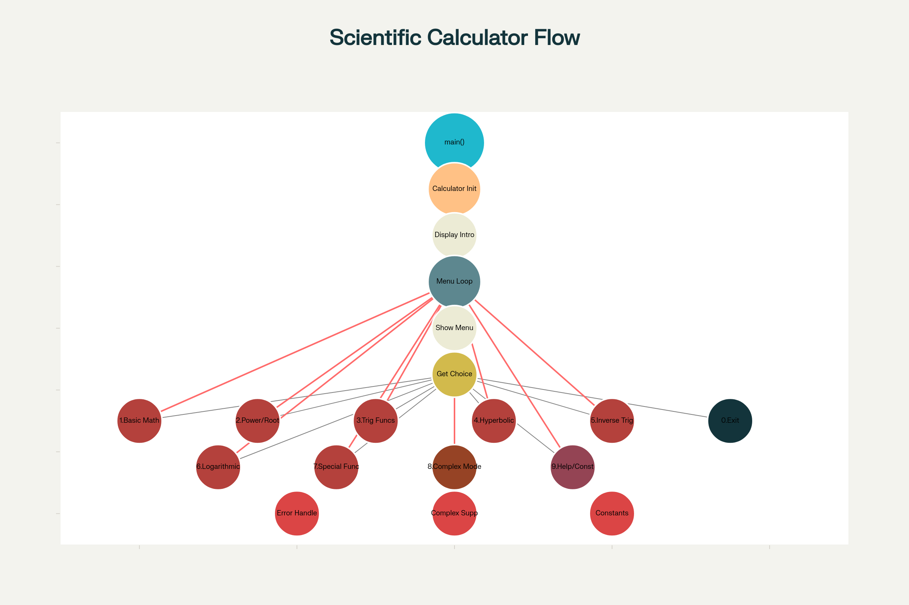
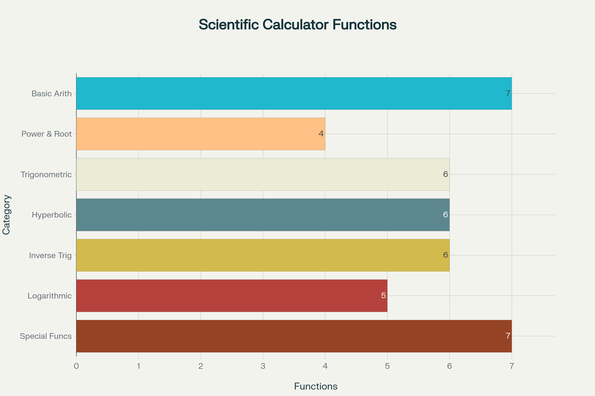

# CalC (pronounced cal-si)
#### Video Demo: [Project video (CalC)](https://www.youtube.com/watch?v=28SRRn1uiY4)
#### Description: An advanced scientific calculator with complex number support built using Python programming language
 

# Advanced Scientific Calculator with Complex Number Support
**A comprehensive Python-based CLI calculator supporting advanced mathematical operations in both real and complex domains**

This calculator implements 50+ scientific functions through an intuitive text interface, combining numerical precision with mathematical rigor. Built using Python's `math` and `cmath` modules, it handles everything from basic arithmetic to complex analysis using Euler's formulas.



## Core Features and Mathematical Implementation

## Fundamental Operations
**Real & Complex Arithmetic**
Supports `+`, `-`, `*`, `/`, with automatic type detection. Complex numbers use `a+ib`/`a+ij` syntax.
Absolute value ($|z|$) calculates magnitude via $|z| = \sqrt{a^2 + b^2}$.

**Exponentiation**
Real: Direct computation using `pow()`.
Complex: Implemented via Euler's formula:
$$
a^b = e^{b(\ln|a| + i(\theta + 2\pi k))}
$$
where $\theta = \arg(a)$. Handles multi-valued nature through principal value selection.

## Advanced Functions

**Trigonometric Suite**
Implements 12 functions (sin/cos/tan + inverses + reciprocals) using domain-appropriate modules:
- Real: `math` module with radian inputs
- Complex: `cmath` equivalents leveraging identities like
  $$
  \sin(z) = \frac{e^{iz} - e^{-iz}}{2i}
  $$

**Hyperbolic Functions**
Computed through exponential definitions:
$$
\sinh(x) = \frac{e^{x} - e^{-x}}{2}
$$
$$
\cosh(x) = \frac{e^{x} + e^{-x}}{2}
$$
Includes reciprocal/inverse variants with complex support.

## Logarithmic Operations

**Multi-Base Support**
- Base e/10: Direct `math.log()` / `math.log10()`
- Arbitrary base: Change-of-base formula:
  $$
  \log_b x = \frac{\ln x}{\ln b}
  $$
- Complex:
  $$
  \ln(z) = \ln|z| + i(\theta + 2\pi k)
  $$
  using polar form

## Special Implementations

**Factorials**
Real non-negative integers only, computed iteratively with overflow checks.

**Modular Arithmetic**
Floor division/modulo disabled in complex mode due to undefined nature in $\mathbb{C}$.

**Constants**
Predefined `pi = π` and `e = Euler's number` accessible in all modes.

## Complex Number Handling
### Representation and Parsing
- Input format: `a+ib` or `a+bj` (case-insensitive)
- Internal storage: `complex` type with `i` display normalization
- Polar conversion: \[ z = r(\cos\theta + i\sin\theta) = re^{i\theta} \]

### Specialized Operations
**Complex Exponentiation**
Implemented via:
$$
z^w = e^{w(\ln|z| + i(\theta + 2\pi k))}
$$
Handles multi-valued results by returning the principal value.

**Inverse Trigonometry**
Uses logarithmic formulations, e.g.:
$$
\arcsin(z) = -i\ln(iz + \sqrt{1 - z^2})
$$

**Roots**
nth roots calculated as
$$
\sqrt[n]{z} = |z|^{1/n}e^{i(\theta + 2\pi k)/n}
$$
For $k=0,1,\ldots,n-1$

## Usage and Interface Design

### Mode Management
**Real Mode**
- Default state
- Auto-converts complex inputs to real if possible
- Disables undefined operations (e.g., complex floor division)

**Complex Mode**
- Activated via menu command
- Forces all numbers to complex type
- Enables full function set with complex outputs

### Input Processing System
```python
def parse_number(inp: str) -> Union[float, complex]:
    """Handles 5 input formats: float, int, scientific notation, a+ib, a+ij"""
    inp = inp.lower().replace('j', 'i')
    if 'i' in inp:
        return complex(inp)
    return float(inp)
```

### Error Handling Architecture
- Custom `CalculatorError` hierarchy
- Type validation layers
- Domain checks for functions like factorial and log
- Overflow/underflow safeguards

## Installation and Execution
**Requirements**
- Python 3.8+
- No external dependencies

**Launch Command**
```bash
python scientific_calculator.py
```

**Sample Complex Mode Operation**
```
> 2+3i ^ 1-i
(2+3i)^(1-i) = -0.015 - 0.179i [Principal Value]
```

## Available Functions

### Basic Operations
- Addition (`+`), Subtraction (`-`), Multiplication (`*`), Division (`/`)
- Floor Division (`//`), Modulo (`%`) - Real mode only
- Absolute Value/Modulus (`|z|`)
- Exponentiation (`a^b`), Power (`x^n`)

### Trigonometric Functions
- Standard: `sin`, `cos`, `tan`
- Reciprocal: `sec`, `csc`, `cot`
- Inverse: `arcsin`, `arccos`, `arctan`, `arcsec`, `arccsc`, `arccot`
- All functions accept radian inputs

### Hyperbolic Functions
- Standard: `sinh`, `cosh`, `tanh`
- Reciprocal: `sech`, `csch`, `coth`
- Inverse: `asinh`, `acosh`, `atanh`

### Logarithmic and Exponential
- Natural logarithm (`ln`)
- Common logarithm (`log10`)
- Custom base logarithm
- Exponential (`e^x`, `10^x`)

### Special Functions
- Factorial (`n!`) - Real non-negative integers only
- Square root and nth root
- Complex conjugate
- Phase angle (argument)
- Degree/radian conversion

### Mathematical Constants
- `pi` (π ≈ 3.14159...)
- `e` (Euler's number ≈ 2.71828...)

## Development and Extension

### Mathematical Foundation
**Key Formulas**
- Euler's Identity:
  $$
  e^{i\pi} + 1 = 0
  $$
- Hyperbolic-Circular Relationship:
  $$
  \sinh(iz) = i\sin(z)
  $$
- Complex Logarithm:
  $$
  \ln(z) = \ln|z| + i\arg(z)
  $$

**Algorithm Choices**
- Iterative factorial over recursive for stack safety
- Principal value selection in multi-valued functions
- Balanced precision/performance in series approximations

### Code Organization
The calculator is implemented as a single-file Python program with the following structure:
- `ScientificCalculator` class containing all functionality
- Menu-driven interface with numbered options
- Comprehensive error handling with user-friendly messages
- Mode switching between real and complex number domains

## Technical Implementation Details

### Complex Number Mathematics
The calculator leverages several advanced mathematical concepts:

**Euler's Formula for Complex Exponentiation**
For computing \[ a^b \] where both a and b can be complex, the calculator uses:
$a^b = \exp(b \cdot \ln(a))$

This approach handles the multi-valued nature of complex logarithms by selecting the principal value.

**Trigonometric Functions in Complex Domain**
Complex trigonometric functions are computed using the relationships:
$$
\sin(z) = \frac{e^{iz} - e^{-iz}}{2i}
$$
$$
\cos(z) = \frac{e^{iz} + e^{-iz}}{2}
$$

**Inverse Trigonometric Functions**
Implemented using logarithmic formulations:
$$
\arcsin(z) = -i \ln(iz + \sqrt{1 - z^2})
$$
$$
\arccos(z) = -i \ln(z + i\sqrt{1 - z^2})
$$

### Error Handling Strategy
- Domain validation for functions like logarithms and square roots
- Type checking to ensure appropriate number formats
- Graceful handling of mathematical errors (division by zero, invalid operations)
- User-friendly error messages with mathematical context

## Usage Examples

### Basic Arithmetic
```
Real Mode: 5 + 3 = 8
Complex Mode: (2+3i) + (1-2i) = 3+1i
```

### Advanced Functions
```
Trigonometric: sin(π/2) = 1.0
Complex Trig: sin(1+i) = 1.298+0.635i
Logarithmic: ln(e^2) = 2.0
Complex Log: ln(-1) = 0+3.142i
```

### Power Operations
```
Real Power: 2^3 = 8
Complex Power: i^i = 0.208+0i (Principal Value)
```

## License and Contribution
MIT Licensed. This project demonstrates advanced mathematical programming concepts and serves both as a practical tool and educational resource for complex number mathematics.

For contributions or bug reports, please ensure all mathematical operations are tested in both real and complex modes, and that error handling maintains the user-friendly interface standards established in the current implementation.